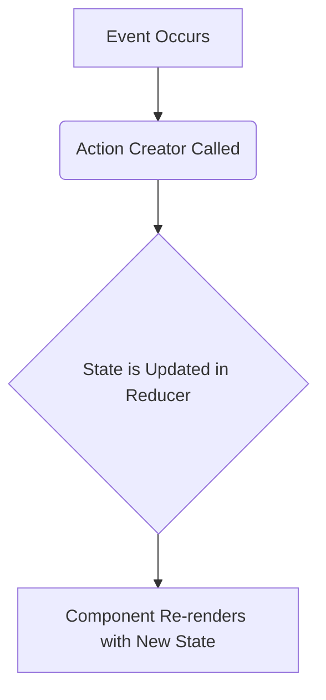
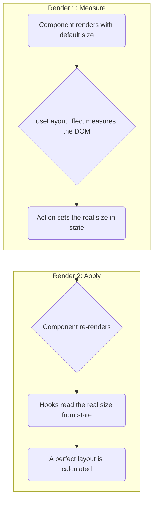

# LineChart Architecture Guide

This document is the single source of truth for the `LineChart` component's architecture. Its purpose is to ensure that all future development is done in a way that is consistent, stable, and maintainable.

## 1. Core Philosophy: State-First

The entire architecture is built around a **single source of truth**: the central state managed by the `useChartState` hook. All data flows in one direction.

- **State is Centralized:** All data required to render the chart lives in one place.
- **Actions are Explicit:** State can only be changed by dispatching clearly defined actions.
- **Hooks are Independent:** Hooks are self-contained and do not call each other. They read from the central state and report their findings back to the state, but they do not depend on each other.

## 2. The Core Hooks

| Hook | Responsibility |
| :--- | :--- |
| `useChartState` | **The Brain.** Holds all chart state. Its reducer is the only place state can be mutated. |
| `useChartActions` | **The Hands.** Provides a stable API of functions to dispatch actions to the reducer. |
| `usePlotlyConfig` | **The Artist.** A "dumb" hook that reads from the central state and returns the data and layout objects required by the Plotly library. |
| `useSimpleResponsive`| **The Ruler.** Measures the container and reports its dimensions back to the central state. |
| `useLegendCarousel` | **The Legend Manager.** Reads from the central state and calculates which legend items should be visible. |

## 3. The Data Flow

All changes follow a predictable, unidirectional data flow.

### **A. User/System Events (e.g., Clicks, Resizing):**

### **B. DOM Measurement for Layout (e.g., Legend Sizing):**
This is a two-render process to ensure perfect layouts without race conditions.

## 4. Rules for Adding New Features

To add a new feature without disrupting the architecture, follow these steps:

1.  **Does it need to store data?**
    - If yes, add a new property to the `ChartState` interface in `useChartState.ts`.

2.  **How will the data change?**
    - Add a new action type to `ChartAction`.
    - Add a new `case` to the `chartReducer` to handle that action.
    - Add a new function in `useChartActions.ts` to dispatch that action.

3.  **How will it affect the visuals?**
    - If it affects the Plotly chart, make `usePlotlyConfig` read the new state property.
    - If it affects the legend, make `useLegendCarousel` read the new state property.

**Golden Rule:** Hooks should **never** call each other directly. They communicate *only* through the central state. By following this rule, we keep the system stable and easy to debug. 